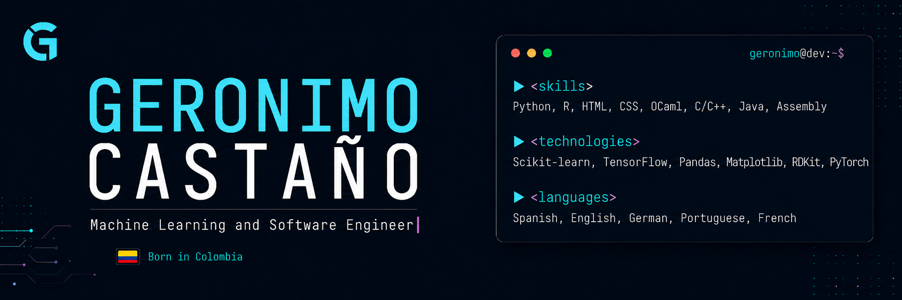

  

# Hi, I'm Geronimo 👋

I'm a Data Science & Artificial Intelligence student at Saarland University, focused on machine learning, software engineering, and AI for scientific applications.

Currently working on active learning pipelines, molecular property prediction, and GNN/Transformer-based models for drug discovery.

## Tech

Python · PyTorch · TensorFlow · scikit-learn · RDKit · pandas · Matplotlib · OCaml · C/C++ · JavaScript · HTML/CSS

## Selected projects

- **Automated McTN Quantification** — PyTorch-based pipeline for detecting and measuring tumor-cell microtentacles.
- **Logic OCaml** — lexer, parser, evaluator, and truth-table generator for logical expressions.
- **Secret Santa Matcher** — small web app for organizing Secret Santa exchanges.

## Languages

Spanish · English · German · Portuguese · French

## Links

[Portfolio](https://github.com/GeronimoCastano) · [LinkedIn](https://www.linkedin.com/in/geronimo-casta%C3%B1o-orozco-622599254/) · [GitHub](https://github.com/GeronimoCastano)
